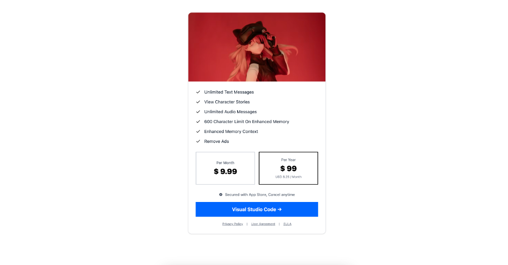

# ProLine Design System

This project is a React implementation of the ProLine Design System, directly synced with Figma.

## Getting Started

1.  **Install Dependencies**

    ```bash
    npm install
    ```

2.  **Start Development Server**
    ```bash
    npm run dev
    ```

## Project Constitution

This project follows strict constitutional principles defined in `.specify/memory/constitution.md`:

- **Clean Code**: Readable, maintainable, self-documenting code
- **Simple UX**: Intuitive interfaces with minimal cognitive load
- **Responsive Design**: Mobile-first, works on all screen sizes
- **Minimal Dependencies**: Lean dependency tree, security-conscious
- **NO TESTING**: Zero testing (no unit/integration/e2e tests) - quality ensured through manual verification and code review

### Updating the Constitution

To update the project constitution with AI assistance:

```bash
# Using GitHub Copilot with custom prompt
Follow instructions in .github/prompts/speckit.constitution.prompt.md
```

The constitution command will:

- Update principles and governance rules
- Increment version according to semantic versioning
- Propagate changes to dependent templates
- Generate a sync impact report

See `.specify/memory/constitution.md` for full details.

## Design System Workflow

### Source of Truth

The design tokens are exported from Figma into `src/all-variables.json`. This file contains the raw definition of all colors, spacing, and typography variables.

### Syncing Tokens

To update the CSS variables in `src/index.css` from the JSON source, run the sync script:

```bash
node src/scripts/sync-tokens.js
```

This script:

- Parses `src/all-variables.json`
- Converts camelCase names to kebab-case CSS variables (e.g., `colorsBrand500` -> `--colors-brand500`)
- Sanitizes spacing tokens (removes parentheses)
- Updates the `:root` and `.dark` blocks in `index.css`

## Components

### Button (`src/components/ui/button.tsx`)

The button component has been audited against Figma Node `1:1183`.

- **Primary**: Yellow (`--colors-brand500`), Semibold text, `h-10` height.
- **Variants**: Supports `secondary`, `outline`, `ghost`, `link`, etc.
- **Sizes**: `default` (40px), `sm`, `lg`, `icon`.

### Subscription Page (`src/pages/SubscriptionPage.tsx`)

A pixel-perfect implementation of the Figma subscription design with light theme.



## Project Structure

- `src/all-variables.json`: Raw Figma variables.
- `src/index.css`: Global CSS with synced variables.
- `src/components/ui`: Reusable UI components.
- `src/scripts/sync-tokens.js`: Utility to sync JSON -> CSS.

# Copilot Custom Agents Demo

A minimal React/Vite frontend demo for GitHub Copilot Custom Agents. It includes a simple `UserCard` component and a small formatting utility used to illustrate agent-driven code reviews and patches.

This README intentionally excludes usage instructions.

Demo route: `/user-card`
